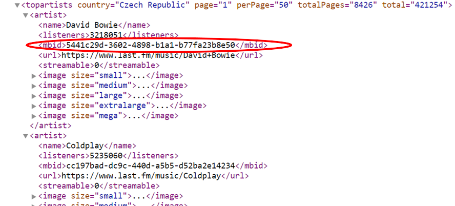
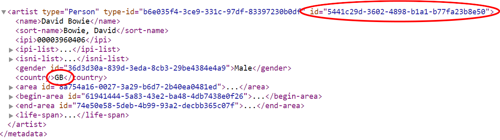
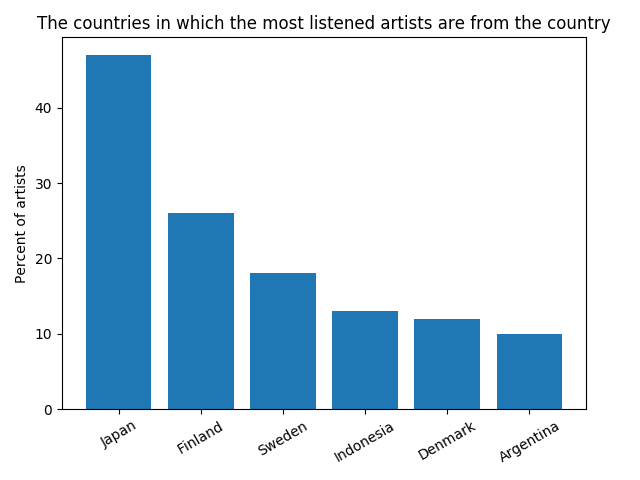

# Data Music Project
This project tries to answer the question: "In which countries do the people listen to artists that are from that country?" 

## Data
The data was collected from [Last.fm](https://www.last.fm/api) and from [MusicBrainz](https://wiki.musicbrainz.org/Development/JSON_Web_Service). Other smaller data sources are mentioned later.

Because the enlish speaking countries would have win without a doubt, I didn't want to have them in my statistics. I was also interested only in bigger, well-known countries.

## Implementation
1. **Sources of states**: At first I needed a source of names of all the states. I used <https://github.com/samayo/country-json/blob/master/src/country-by-population.json> from which I immediately filtred away countries with less then 5 million population. Then I removed all countries in which the people are speaking english (<https://github.com/samayo/country-json/blob/master/src/country-by-languages.json>, lightly editted).
2. **Last.FM API**: When I had all the states I wanted, I could start requesting Last.fm API. I wanted to get one hundred most listened artists of every country. I sent url requests simiral to this one: http://ws.audioscrobbler.com/2.0/?method=geo.gettopartists&country=*wanted_country*&api_key=*my_api_key*&format=json (where api_key is my Last.fm API key I received in order to access their API). The server sent me back a json file containing info about the top artists in the country. In the first figure (I used XML for better representation) you can see an example of such file. I saved only the mbid attribute (which stands for MusicBrains ID) - the ids are stored in Data/TopArtists/*country*.json. 
3. **MusicBrains.org**: On Last.fm there is no information about the artist's country, so I had to use another service - music database MusicBrainz. As mentioned earlier, the Last.fm stores mbid attribute, through which I could easily access the artist on MusicBrainz, again using url request: http://musicbrainz.org/ws/2/artist/*mbid*?fmt=json (mbid - the attribute from Last.fm). I recieved json file containing information about the artist, where was also the abbreviation of his country (as shown on the second figure). 
4. **Country abbreviations**: The last main step was to change the states' abbreviations to whole country name. I used <https://datahub.io/core/country-list> for this. The result is Data/ArtistsCountry.json, where are stored all the loaded artists with their country.
5. **Analyzing the data**: Finaly, I had all the data saved locally and prepared for analysis. I counted the number of artists listened in countries from which they are. Then I sorted the countries, left only those with more than 8 artists and saved the data to Data/final-data.json and made a graph. 

### Issues
There were several small issues I had to deal with: blank data in url respond, not enough information about the artists on servers, some ids didn't find the right author. It was also forbidden to send more than few requests per second, so I had to save a lot of data locally for later access.
